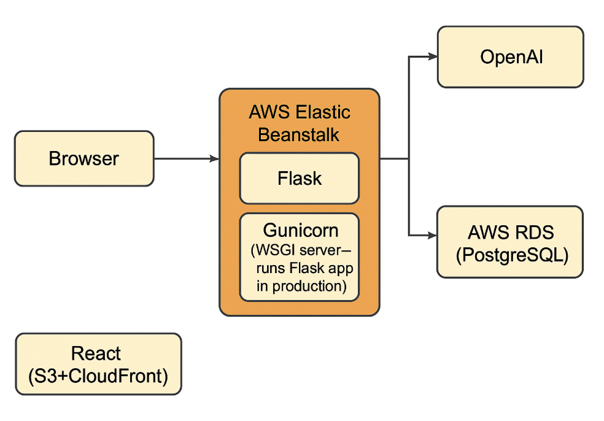

# 🍳 HomeRecipe — AI-Powered Cooking Assistant

HomeRecipe is a full-stack web app that helps users discover recipes based on their available ingredients — powered by OpenAI GPT-4.

---

## 🧠 Overview

Users can:
- ✍️ Sign up with their name  
- 🥕 Enter ingredients (with live category-based suggestions)  
- 🤖 Generate 2-3 personalized recipes using AI  
- 💾 Save ingredients & recipes in a PostgreSQL database  
- 🌐 Access the backend hosted on AWS Elastic Beanstalk  

---

## 🏗️ Architecture Diagram


**Flow**
1. The React frontend sends requests (signup, suggestions, recipe generation) →  
2. Flask backend on **AWS Elastic Beanstalk** →  
3. Connects to **AWS RDS (PostgreSQL)** for data →  
4. Calls **OpenAI API** for AI recipe suggestions →  
5. Returns results back to the browser.


---

## 🧰 Tech Stack

| Layer | Technology |
|-------|-------------|
| **Frontend** | React + Vite + Tailwind CSS |
| **Backend** | Flask (Python) + Gunicorn |
| **Database** | PostgreSQL on AWS RDS |
| **AI** | OpenAI API (GPT-4) |
| **Hosting** | AWS Elastic Beanstalk |
| **Version Control** | Git + GitHub |

---

## 🚀 Live API (Backend)

🟢 **AWS Elastic Beanstalk URL:**  
https://homerecipe-env.eba-p9uqkqni.us-west-2.elasticbeanstalk.com/

Example endpoint:

GET /user/<username>
POST /signup
GET /generate-recipe/<username>

---

## 🧩 Local Setup (Developers)

```bash
# Clone project
git clone https://github.com/dinabdra/homerecipe.git
cd homerecipe

# Create a Python virtual environment
python3 -m venv venv
source venv/bin/activate

# Install dependencies
pip install -r requirements.txt

# Run backend
python3 app.py

# In a separate terminal, run frontend
cd home-recipe-frontend
npm install
npm run dev

Features

✅ User sign-up with ingredient storage
✅ Dynamic ingredient suggestions by category
✅ AI recipe generation using OpenAI
✅ PostgreSQL database integration
✅ Flask REST API hosted on AWS
✅ Responsive, modern React frontend

Project Structure

homerecipe/
│
├── app.py                   # Flask backend
├── requirements.txt          # Python dependencies
├── init_db.py                # DB initializer (if used)
├── venv/                     # Virtual environment
│
├── home-recipe-frontend/     # React frontend
│   ├── src/
│   │   ├── App.jsx           # Main UI
│   │   ├── config.js         # API base URL
│   │   └── ...
│   └── public/
│       └── food/             # Background images
│
└── README.md
